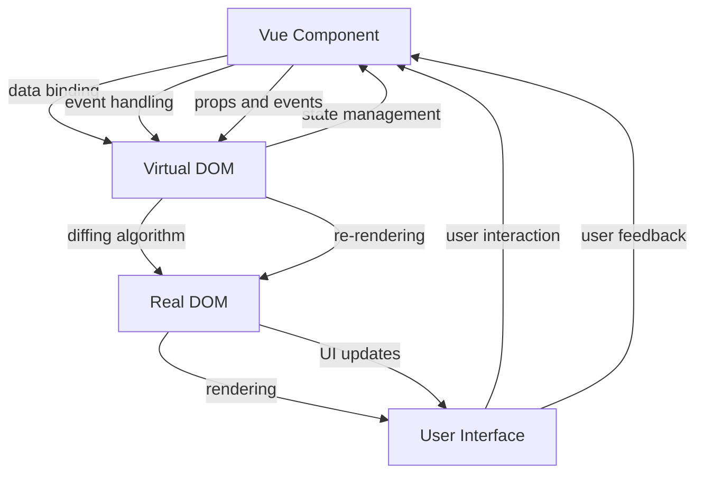
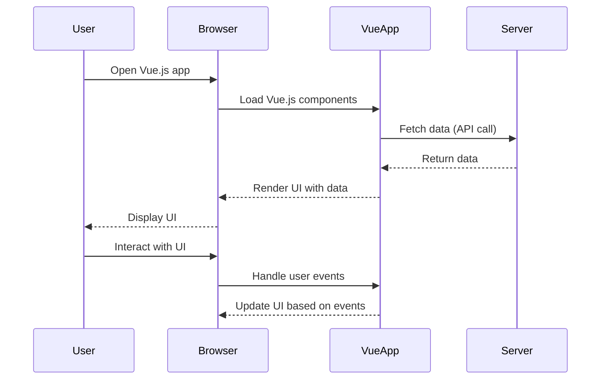

# Vue.js 3

## What is Vue.js?
- JS/TS framework for building user interfaces, SPAs, and PWAs
- Used to create dynamic and data-driven web applications
- Component-based architecture
- Create standalone widgets

## How does it work?
- Vue.js uses a virtual DOM to efficiently update the UI



## Typical Vue website



## SPA
- Single Page Application
- Only a single HTML page sent(initially) to the browser
- Subsequent interactions with the app do not require a full page reload
- Vue intercepts subsequent requests and handles "page" changes in the browser by swapping what components are shown on the page.
- Results in a much faster and smoother website experience

## New features in Vue 3
- Composition API:
  - Imrproves on reusability, organization & readability 
  - setup() function for component logic
- Multiple root nodes:
  - Components can have multiple root elements
    ```vue
    <template>
        <div>Root 1</div>
        <div>Root 2</div>
    </template>
    ```
- Teleport:
  - Allows rendering a component in a different part of the DOM
    ```vue
    <teleport to="#modal">
        <div>Modal Content</div>
    </teleport>
    ```

- Suspense:
  - Allows components to wait for asynchronous data before rendering
    ```vue
    <suspense>
        <template #default>
            <async-component />
        </template>
        <template #fallback>
            Loading...
        </template>
    </suspense>
    ```
- TypeScript support:
  - Improved TypeScript integration
  - Better type inference and tooling support


**Install `Vetur` exetension in VSCode for Vue.js syntax highlighting and IntelliSense**